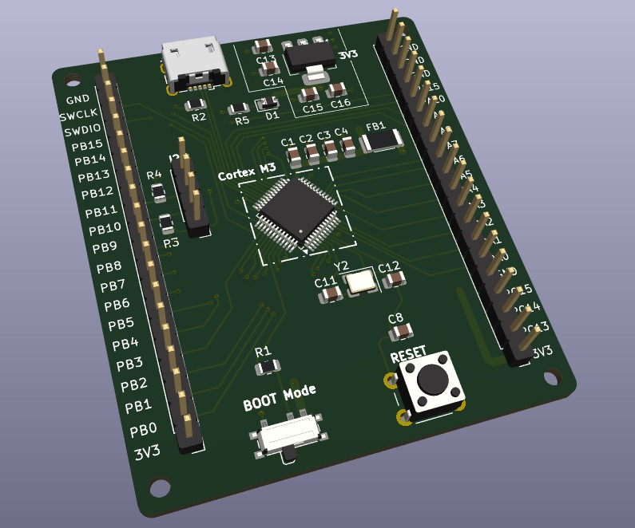
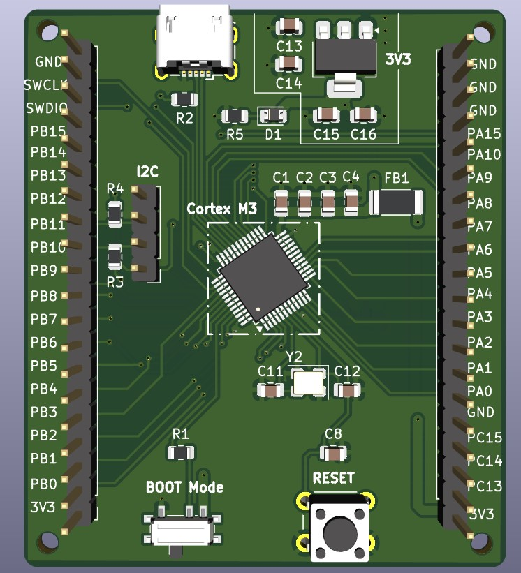
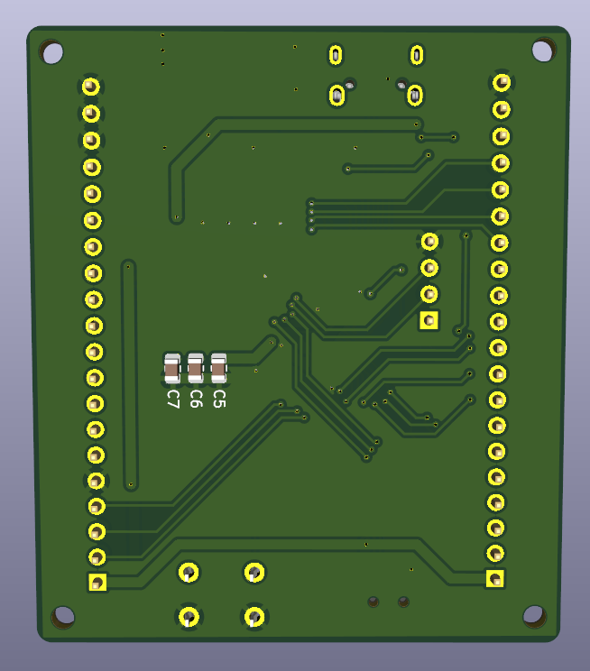

# STM32 Board Design using KiCad

## Overview

This repository showcases the design of a **custom STM32F100CTB development board**, created using **KiCad** as part of a **Learning & Development (L&D)**.
The board serves as a hands-on platform for exploring **embedded systems**, **ARM Cortex-M microcontrollers**, and **mixed-signal PCB design** practices.

The goal of this project is to provide a compact yet powerful **training and development board** that allows learners to understand the fundamentals of microcontroller hardware, PCB layout, and circuit design — from schematic to prototype.

> The image above shows the top and bottom view of the PCB — featuring the STM32 microcontroller at the center, USB Type-B port at the top, and dual GPIO headers for flexible use.

---

## Key Features

- **Microcontroller**
  - STM32F100 (ARM Cortex-M3) — ideal for entry-level embedded learning and control applications  
  - QFP package for reliable assembly and accessible signal routing  

- **Connectivity & Expansion**
  - Dual header rows (J5, J6) providing access to all GPIO pins  
  - USB Type-B connector for power and programming  
  - SWD header for debugging and firmware upload  

- **User Controls**
  - Tactile pushbutton (SW1) for reset or user input  
  - Slide switch (SW2) for mode selection or power control  

- **Power Management**
  - On-board regulation from 5V or USB to 3.3V  
  - Decoupling capacitors and ferrite filtering for clean power delivery  
  - Supports both USB and external supply input  

- **PCB Design**
  - Designed entirely in **KiCad**  
  - **4-layer stack-up** for signal and power integrity  
  - Inner layers dedicated to **power and ground planes**  
  - Careful analog/digital separation for reduced noise and EMI  
  - Compact form factor with clean routing and labeled headers  

---

## Design Goals

This board was developed with the following objectives:

- Serve as a **training and educational tool** for PCB design and embedded systems.  
- Provide a **reusable development board** for experimenting with STM32 peripherals (GPIO, UART, SPI, I²C, ADC, PWM, etc.).  
- Explore **best practices in mixed-signal layout**, decoupling, and grounding.  
- Strengthen understanding of **KiCad workflow**, from schematic capture to PCB fabrication and assembly.  

### Key Components

| Reference | Component | Function |
|------------|------------|----------|
| U1 | STM32F100CTB | Main microcontroller |
| U2 | Voltage regulator | 5V → 3.3V conversion |
| Y2 | Crystal oscillator | MCU clock source |
| SW1 | Pushbutton | Reset/User input |
| SW2 | Slide switch | Mode/Power select |
| J5 / J6 | Pin headers | GPIO expansion |
| J4 | SWD header | Debug/programming interface |
| USB | Type-B connector | Power & communication |

---

## Learning Outcomes

Through this project, students and engineers gain hands-on experience with:

- **Schematic design** in KiCad  
- **Component library management**   
- **Grounding and decoupling strategies**  

This board also provides a reusable reference for future mixed-signal designs and embedded control experiments.

---

## Applications

- Embedded systems education and prototyping  
- Real-time control and automation projects  
- Peripheral testing and firmware development  
- Hardware design learning modules  

---

